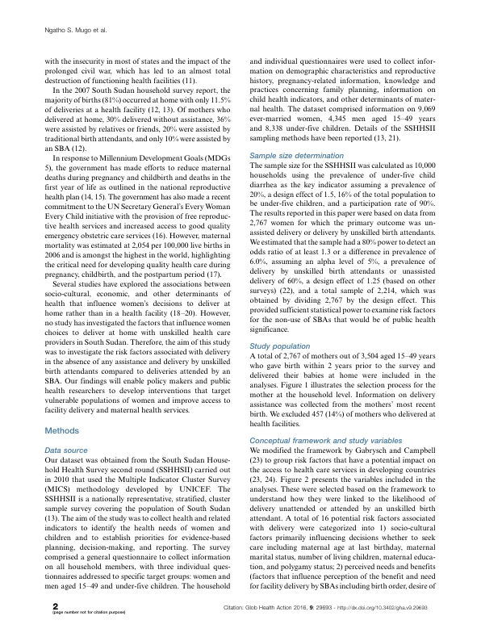
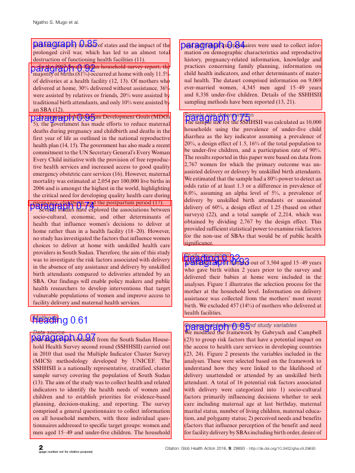

# YOLOv3MLNet
Use the YOLO v3 algorithms for object detection in C# using ML.Net

Case study on a document layout YOLO trained model.

Model can be found in the following Medium article: [Object Detection — Document Layout Analysis Using Monk AI](https://medium.com/towards-artificial-intelligence/object-detection-document-layout-analysis-using-monk-object-detection-toolkit-6c57200bde5)

# Train and export to onnx in Python

# Check exported model with Netron

# Load model in C#

# Predict in C#

